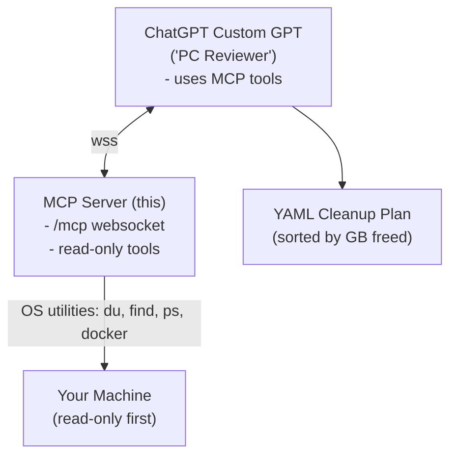

# PC Reviewer LLM (Custom GPT + MCP Connector)

A cautious, read-only PC reviewer that lets a Custom GPT on chatgpt.com inspect your machine (disk usage, large files, caches, Docker usage, top processes) and propose a prioritized cleanup plan. You keep full control: destructive actions are opt-in and gated per command.

## Protocol

- **Protocol:** Model Context Protocol (MCP) via WebSocket (Remote MCP)
- **Server:** Python + FastAPI + websockets; cross-platform (macOS/Linux; Windows planned)
- **Connector:** ChatGPT Custom GPT → MCP Connector to this server
- **Security model:** read-only by default; optional `exec.run` behind explicit user approval & allowlists

## Why this exists

Local disks fill up with build artifacts, caches, simulator data, containers, and logs. “Cleaner” apps are opaque and risky. This project keeps the LLM outside your machine and exposes only narrow, auditable tools that generate a plan you can verify and approve.

## Features

### Read-only tools

- `fs.du(path, depth)` — directory sizes
- `fs.bigfiles(path, min_size, limit)` — biggest files
- `pkg.caches()` — Homebrew / npm / pip cache sizes
- `docker.df()` — Docker size info
- `proc.top(limit)` — top memory/CPU processes

Cleanup plans (LLM output) are YAML ranked by GB freed with rationale, risk level, dry-run commands, verification, and rollback.

### Guardrails

- Deny deleting `~/Documents`, `~/Pictures`, `~/Desktop` by default
- Dry-run/report-first commands
- Optional `exec.run` tool is off by default
- Auditability: every tool call and approved command is loggable

## Architecture



## Repo layout

```text
pc-reviewer-mcp/
├─ README.md
├─ src/
│  ├─ mcp_server.py          # WebSocket MCP endpoint + tool registry
│  ├─ tools/
│  │  ├─ fs_tools.py         # du, bigfiles
│  │  ├─ pkg_tools.py        # brew/npm/pip caches
│  │  ├─ docker_tools.py     # docker df
│  │  ├─ proc_tools.py       # top processes (psutil)
│  │  └─ exec_tool.py        # optional, disabled by default
│  └─ logging_middleware.py  # request/response logging, redaction
├─ requirements.txt
├─ .env.example              # PORT, ALLOWLIST paths, etc.
├─ Makefile                  # dev targets (run, lint, test)
├─ scripts/
│  └─ dev-tunnel.sh          # ngrok/cloudflared quick-start
├─ tests/
│  ├─ test_fs_tools.py
│  ├─ test_pkg_tools.py
│  └─ test_protocol.py
├─ .github/
│  ├─ ISSUE_TEMPLATE.md
│  └─ workflows/ci.yml
└─ LICENSE
```

## Quick start

### 1. Prereqs

- Python 3.10+
- macOS or Linux (Windows support tracked in Issues)
- Optional: Docker Desktop (if you want `docker.df`)
- A tunneling tool (ngrok or cloudflared) if you run locally

### 2. Install & run

```bash
git clone https://github.com/your-org/pc-reviewer-mcp.git
cd pc-reviewer-mcp
python3 -m venv .venv && source .venv/bin/activate
pip install -r requirements.txt

# Start server (defaults: 0.0.0.0:8765, ws route /mcp)
uvicorn src.mcp_server:app --host 0.0.0.0 --port 8765
```

### Optional: expose it securely

```bash
# Example: cloudflared (no account needed for quick tunnel)
cloudflared tunnel --url http://localhost:8765
# Note WSS URL (e.g., wss://random.trycloudflare.com/mcp if you map /mcp path)
```

### 3. Create the MCP Connector in ChatGPT (Team/Enterprise/Edu)

1. In ChatGPT: **Settings → Connectors → Add custom connector**
2. Type: **Remote MCP (WebSocket)**
3. URL: `wss://<your-tunnel-host>/mcp`
4. Name: **PC Reviewer**
5. Save.

### 4. Create your Custom GPT

1. ChatGPT: **Explore → Create a GPT → Configure**
2. Connectors: enable **PC Reviewer**.
3. Instructions (paste):

```markdown
You are a cautious PC Reviewer. Use the MCP tools:
- fs.du(path, depth)
- fs.bigfiles(path, min_size, limit)
- pkg.caches()
- docker.df()
- proc.top(limit)

Workflow:
1) Gather facts using tools.
2) Output a YAML CLEANUP PLAN sorted by estimated GB freed (descending). Each action includes:
   - title, rationale, est_space_gb, risk (Low/Medium/High)
   - commands.macos / linux / windows (prefer dry-run/report-first)
   - verification steps and rollback notes
3) Never propose deleting Documents/Pictures/Desktop unless user explicitly asks.
4) If an execution tool exists, require user to type APPROVE "<command>" before any destructive action.
```

4. Save.

## Using it

Ask your GPT:

- “Scan my home folder to depth 2 and show the top 25 heaviest directories.”
- “List files over 500MB in ~/Downloads (limit 150).”
- “Estimate cache cleanup (brew/npm/pip) and Docker savings.”
- “Draft a cleanup plan with only dry-run commands.”

You'll get a ranked YAML plan. Copy/paste commands you agree with into your terminal—or enable the optional `exec.run` tool later.

## Optional: opt-in execution tool

Disabled by default. When you're ready:

- Add/enable `exec.run` in `src/tools/exec_tool.py` with:
  - explicit user APPROVE requirement,
  - path allowlists (e.g., Xcode DerivedData, simulator devices),
  - server-side logging,
  - dry-run flags where possible.

Example policy (conceptual):

```python
SAFE_PREFIXES = [
  os.path.expanduser("~/Library/Developer/Xcode/DerivedData"),
  os.path.expanduser("~/Library/Caches"),
]

# Only allow rm within SAFE_PREFIXES, and require params.approved == True
```

## Security posture

- Default read-only. No deletions without explicit opt-in.
- Denylist & allowlist. Refuse core system paths and user content by default; only allow known cache/artifact dirs.
- Dry-run first. Prefer `brew cleanup -n -s`, `docker system df`, `du -sh` comparisons.
- Audit log. Log tool calls and approved commands with timestamp and arguments (redact paths if requested).

## Cross-platform notes

- macOS & Linux: `du`, `find`, `ps`, `docker` should work out of the box.
- Windows (tracked in Issues): replace with PowerShell equivalents (`Get-ChildItem`, `Measure-Object`, `Get-Process`), WSL detection, and Docker Desktop data paths.

## Development

```bash
make run          # uvicorn dev server
make lint         # ruff/flake8 (configure as you like)
make test         # pytest
```

## Env vars (.env.example)

```env
PORT=8765
LOG_LEVEL=info
ALLOWLIST=/Users/you/Library/Developer/Xcode/DerivedData:/Users/you/Library/Caches
DENYLIST=/Users/you/Documents:/Users/you/Desktop:/Users/you/Pictures
```

## Example tool semantics (JSON-RPC over WS)

```json
# Request: list tools
{"id":"1","method":"tools.list","params":{}}

# Response
{"id":"1","result":{"tools":["fs.du","fs.bigfiles","pkg.caches","docker.df","proc.top"]}}

# Call a tool
{"id":"2","method":"tools.call","params":{"name":"fs.du","arguments":{"path":"~","depth":2}}}

# Result
{"id":"2","result":{"name":"fs.du","data":[{"path":"/Users/you","kb":1234567}, ...]}}
```

## Sample prompts for your GPT

- “Use fs.du (depth 2) on ~ and pkg.caches, then return a single YAML cleanup plan with dry-run commands only.”
- “Find duplicates is out-of-scope; instead, report top 50 files >500MB with fs.bigfiles.”
- “Do not propose removing any user docs/photos; stay in caches/artifacts only.”

## Roadmap (issues to open on day 1)

- Windows support: PowerShell tools (`Get-ChildItem`, `Measure-Object`, `Get-Process`), WSL path mapping.
- Exec tool (opt-in):
  - Approval handshake (`APPROVE "<command>"`)
  - Path allowlist policy
  - Logging + dry-run support
- Docker metrics: parse `docker system df -v` into structured totals per image/volume.
- Browser caches (opt-in): profile directory detection and reporting (no deletes by default).
- Configurable policies: YAML policy file to define allow/deny and risk levels.
- Telemetry toggle: local JSON logs only; no network egress by default.
- Tests: fixtures for `du`/`find` outputs; contract tests for WS protocol.
- CI: lint/typecheck/tests on PR; pre-commit hooks.
- Docs: “Enable connector in Custom GPT” screenshots; troubleshooting guide.
- Release: Dockerfile & Compose for self-hosting; Caddy/Nginx reverse proxy snippet with WSS.

## Contributing

- Open an issue first for major changes.
- Write tests for new tools or policy changes.
- Keep default behavior read-only and safe.

## License

MIT (or your preference). Add a NOTICE if you bundle third-party examples.

